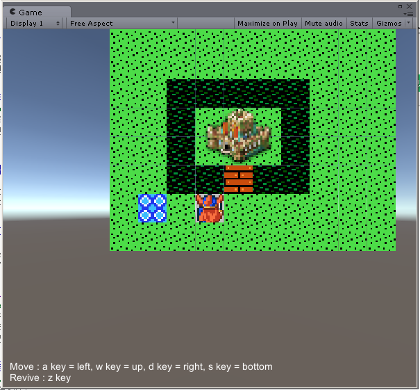

TileMapEngineUnity3D
====================

무슨 프로그램?
--------------
유니티에서 타일 맵 기반 게임을 만들때 사용할수 있다. 유니티 에디터 기능으로 만든 에디터도 같이 제공됨으로 맵을 만들고, 오브젝트를 배치 할수 있음.

구성 요소
---------

### 타일맵 엔진

TileMapEngine.cs 에 구현 되있다. 타일들로 만들어진 맵을 로드하는 기능이 있다. 로드된 맵에서 길찾기 기능을 제공한다. 길찾기 기능은 unity wiki 의 A-Start 알고리즘 코드를 가져다가 조금 수정한 정도다. 길찾기시 오브젝트 고려 할지, 목표 지점의 오브젝트 체크 여부 정도 기능 추가. [Unity Wiki AStart](http://wiki.unity3d.com/index.php/AStarHelper)

```cs
List<SquareTileMapNode> pathNodes = TileMapEngine.Instance.Calculate(tileNode, mapTile, checkObjWhenPathFind, goalCheckObjWhenPathFind);

if (pathNodes != null && pathNodes.Count > 0)
    player.AutoMove(ref pathNodes);
```

### 타일맵 에디터

타일로된 맵을 쉽게 만들기 위한 에디터 이다.

![TileMap Editor screenshot][tilemap_editor_screenshot]


기능들:

* 타일 오브젝트를 X x Y 로 배치해서 타일맵 오브젝트를 만든다.
* 만들어진 타일맵의 데이터를 파일로 뽑아내는 기능.
* 정적인 오브젝트 그룹을 만드는 기능. (단순히 오브젝트 들을 배치하고 그룹으로 만든다.)
* 맵에 오브젝트 그룹을을 배치하고 위치 데이터를 파일로 뽑아내는 기능.
* 씬화면 에서 타일(`ITileMapNode`), 오브젝트(`TileObject`) 만 선택하는 기능.
* 에디터 모드에서 씬화면에 시작지점, 목표지점 설정하고 길찾기 테스트 해보는 기능.


### 테스트 프로젝트

TileMapEngineUnityProject 가 Unity 5.3 으로 작업된 유니티 프로젝트.

Assets/TestProject/Scenes/BattleScene.unity 해당 씬을 열어서 테스트 프로그램을 확인할수 있다.



---

[tilemap_editor_screenshot]: Images/TileMapEditor.png "TileMap Editor"
[cvs_wiki]: https://ko.wikipedia.org/wiki/CSV_(%ED%8C%8C%EC%9D%BC_%ED%98%95%EC%8B%9D)
